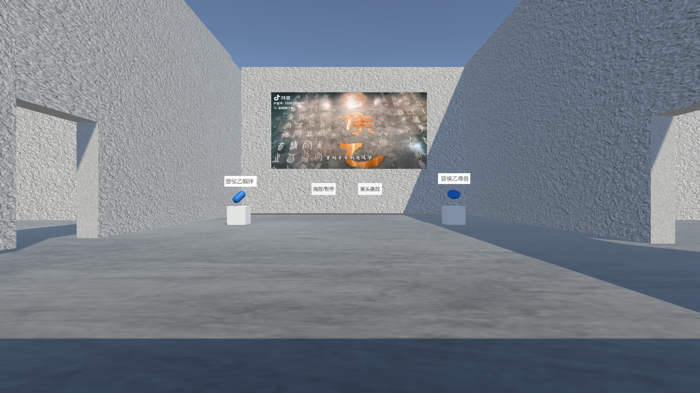

# 湖北省博物馆虚拟漫游



基于团结引擎（Unity 2022.3 LTS，版本 2022.3.62f2c1）开发的第一人称 3D 数字博物馆，还原湖北省博物馆展厅与 10 件镇馆文物，支持中英双语语音讲解、展品导航、答题测验与小地图，构成完整的虚拟参观体验闭环。

## 功能特性

- 🚶 **第一人称漫游** — CharacterController 驱动，WASD 移动 + 鼠标视角控制
- 🏺 **10 件文物交互** — 越王勾践剑、曾侯乙编钟、曾侯乙尊盘、郧县人头骨化石、虎座鸟架鼓、崇阳铜鼓、云梦睡虎地秦简、石家河玉人像、元青花四爱图梅瓶、彩绘人物车马出行图
- 🔊 **中英双语讲解** — 每件文物配备中文/英文两套语音，支持播放/暂停、重头播放、语言切换
- 🧭 **路径导航** — Tab 打开文物列表选择目标，地面生成绿色导航线（预设路径点，避开墙体），到达自动结束，支持手动取消
- 📝 **答题测验** — 10 道单选题，逐题判分（满分 100）、答案解析、上一题回看锁定
- 🗺️ **小地图** — 俯拍相机 + RenderTexture 实时渲染，玩家箭头随坐标映射实时更新
- 🎬 **展馆介绍视频** — VideoPlayer + RenderTexture 墙面投屏，支持播放控制

## 操作说明

| 输入 | 功能 |
|------|------|
| WASD | 移动 |
| 按住鼠标左键拖动 | 旋转视角 |
| 鼠标悬停文物 | 显示文物名牌 |
| 悬停后按 F | 打开文物详情（锁定移动） |
| G | 关闭详情，恢复移动 |
| Tab | 打开 / 关闭导航列表 |
| H | 关闭答题面板 |
| 鼠标点击 | UI 按钮交互（选导航目标 / 答题 / 音视频控制） |

## 运行项目

1. 安装 **团结引擎 2022.3.62f2c1**（兼容 Unity 202.3 LTS 版本）
2. 克隆本仓库，通过 Unity Hub / Tuanjie Hub 打开工程
3. 打开 `Assets/Scenes/SampleScene.unity`，点击 Play

> 💡 若打开工程时提示 `cn.tuanjie.ai.generators` 包解析失败（本地 AI 资产生成工具，仓库中不包含其本地目录），在 `Packages/manifest.json` 中删除该依赖即可，不影响项目运行。

## 项目结构

```
Assets/
├── Audio/        # 10 件文物的中/英文讲解音频（20 个 MP3）
├── Materials/    # 场景材质
├── Prefabs/      # 10 件文物预制体
├── Scenes/       # SampleScene
├── Scripts/      # 12 个核心游戏脚本
├── Texture/      # 文物图片 / UI 背景 / 小地图 RenderTexture
└── Vedio/        # 展馆介绍视频 + 视频 RenderTexture
```

## 核心实现

- **单例管理器架构**：`GameManager` / `UIManager` / `AudioManager` 统一调度游戏状态、UI 面板与全局音频；查看详情时自动锁定玩家移动、关闭后恢复
- **文物交互**：`ShowNameOnHover` 基于 `OnMouseEnter/Exit` 悬停检测驱动名牌显隐，复用全局 `AudioSource` 完成双语讲解的播放控制与语言切换
- **路径导航**：`NavigationManager` 采用"预设路径点 + LineRenderer"方案，按"玩家 → 途经点 → 目标文物"逐段绘制导航线，结合到达距离判定自动收线
- **答题系统**：`QuizManager` 以逐题独立状态数组记录作答情况，已答题目回看锁定、不可重选，实时计分与结果解析
- **小地图**：`MiniMapMark` 将玩家世界坐标经 `WorldToViewportPoint` 映射为小地图 UI 坐标，同步箭头旋转朝向并驱动俯拍相机跟随玩家
